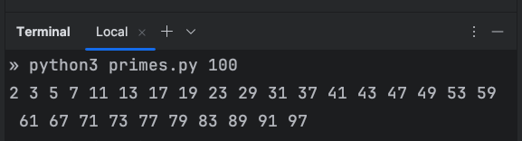
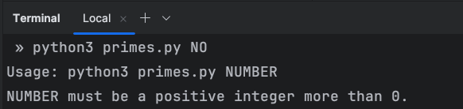

# Robot_Dreams Shitty Code Challenge

## Sieve of Eratosthenes
The program prints all [prime numbers](https://en.wikipedia.org/wiki/Prime_number) up to a given number.
It's an implementation of the famous [Sieve of Eratosthenes](https://en.wikipedia.org/wiki/Sieve_of_Eratosthenes) algorithm.

NOTE: According to the task's requirements, the code is intent to be *as bad as possible*.

### Prerequisites
- Python 3

### How to use
Run the next command:
```bash
python3 primes.py NUMBER
```
where `NUMBER` is the number up to which you want to print all prime numbers (a positive integer more than 0).

#### Examples:




